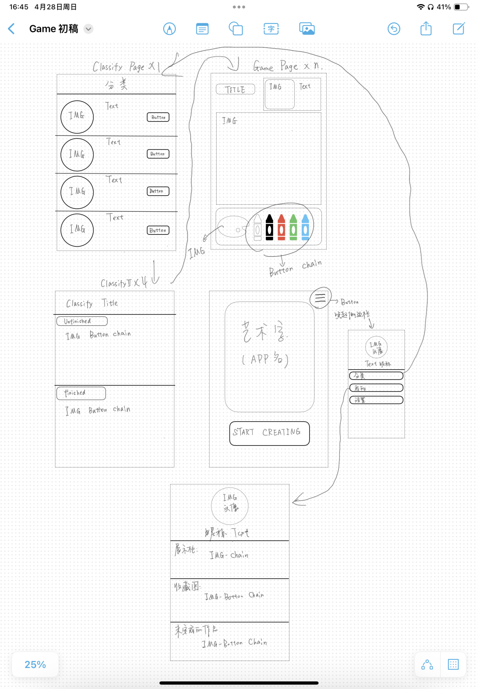

# EL程设大赛项目

## 基本介绍
本项目为**南京大学软件学院**与**南京大学智能软件与工程学院**联合举办的EL程序设计大赛 交互组 参赛项目，主题为**科技赋能促进文化产业革新**

## 选题
国风填色游戏(名字未定)

## 成员
周旭（队长），王慕晨，单煜翔，朱业航

## 框架(中期)

先按照这个糊弄一下再说

## 分工

## 知识需求
- 项目构建: 安卓开发(Kotlin/Java, xml, Android Studio)
- 进程管理: Git, Github
- 文档：Markdown, PPT

## 时间进度

这是什么？做个梦先zzz

## 仓库框架介绍